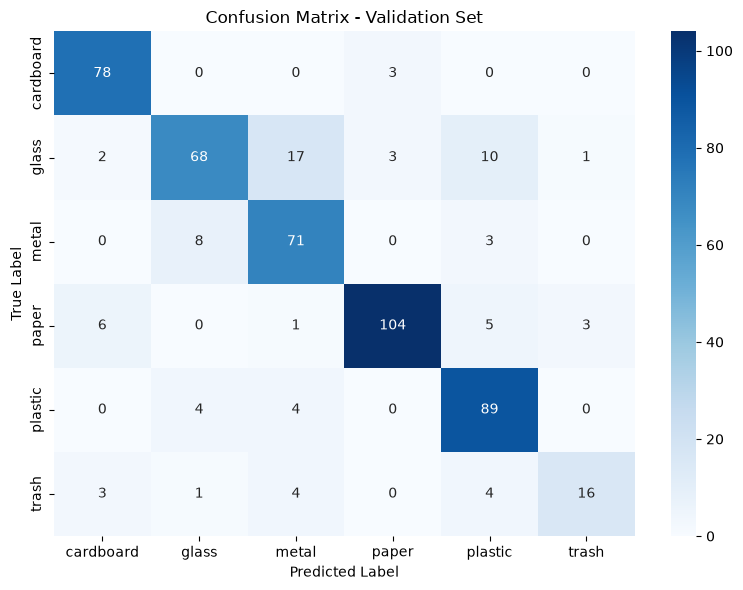

# Garbage Classification using CNN (AlexNet)
---

## Deskripsi

Proyek ini mengimplementasikan klasifikasi sampah otomatis menggunakan **Convolutional Neural Network (CNN)** berbasis arsitektur **AlexNet** dengan teknik *transfer learning* menggunakan framework **PyTorch**.

Model dilatih untuk mengklasifikasikan gambar sampah ke dalam **6 kategori**:

| Kelas | Deskripsi |
|-------|-----------|
| `cardboard` | Kardus dan kemasan karton |
| `glass` | Botol dan pecahan kaca |
| `metal` | Kaleng dan benda logam |
| `paper` | Kertas dan dokumen |
| `plastic` | Botol dan kemasan plastik |
| `trash` | Sampah umum lainnya |

---

## Arsitektur Model

Model menggunakan **AlexNet** sebagai *pretrained backbone* yang di-*fine-tune* pada dataset sampah. AlexNet terdiri dari:

- **5 Convolutional Layers** — ekstraksi fitur gambar
- **3 Fully Connected Layers** — klasifikasi fitur
- **Output Layer** — disesuaikan menjadi 6 kelas (dari 1000 kelas ImageNet)

Teknik **Transfer Learning** digunakan untuk memanfaatkan bobot yang telah dilatih pada dataset ImageNet, sehingga mempercepat konvergensi dan meningkatkan akurasi meskipun dengan data terbatas.

---

## Hasil

### Sample Predictions

### Confusion Matrix

---

- Krizhevsky, A., Sutskever, I., & Hinton, G. E. (2012). *ImageNet Classification with Deep Convolutional Neural Networks*. NeurIPS.
- [PyTorch Documentation](https://pytorch.org/docs/stable/index.html)
- [Torchvision Models — AlexNet](https://pytorch.org/vision/stable/models/alexnet.html)
